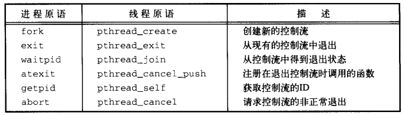

# C语言

## 内存分配

* void \* malloc(size\_t n); 未初始化的，memset初始化
* void free(void \* p); 只是释放指针指向的内容 野指针，null
* void \*calloc(size\_t n, size\_t size); 初始化为0，适合为数组申请空间
* void \* realloc(void \* p, size\_t n); 将指针 p指向的内存块的大小改变为n字节，可能新地址

## popen、system函数

popen、system函数（调用了fork、exec、waitpid，三种返回值）

system()来执行一个shell命令，popen()也是执行shell命令并且通过管道和shell命令进行通信。

system在执行期间调用进程会一直等待shell命令执行完成(waitpid等待子进程结束)才返回，但是popen无须等待shell命令执行完成就返回了。我们可以理解system为串行执行，在执行期间调用进程放弃了”控制权”，popen为并行执行。如果你没有在调用popen后调用pclose那么这个子进程就可能变成”僵尸”。

## 进程

fork：函数创建子进程，通常情况用来执行另一个程序的，如果是执行同一个进程那么多数采用线程。

exec函数族

vfork 和fork 之间的另一个区别是：vfork 保证子进程先运行，在她调用exec 或exit 之后父进程才可能被调度运行。如果在调用这两个函数之前子进程依赖于父进程的进一步动作，则会导致死锁。

当子进程退出时，系统不会立即删除该子进程的进程描述符，并将进程状态设置为Z（zombie），然后等待父进程处理子进程的退出。如果父进程不处理，那么子进程就会一直处于僵尸状态。

父进程处理子进程使用wait函数族。当使用wait函数处理完子进程的终止状态后，子进程才彻底的消失了，在次调用wait函数处理该子进程将会出错。

在使用wait函数时，一般等待三种进程的退出

* 等待任意一子进程退出
* 等待具体的某个子进程退出
* 等待某个进程组的任意一子进程退出

一般情况下wait函数的目的就是取出子进程的终止状态，但是通过设置一些选项，我们可以控制wait的一些行为，比如非阻塞式的，只查看是否有子进程退出，而不取出该子进程的终止状态等。

wait阻塞、waitpid不阻塞

